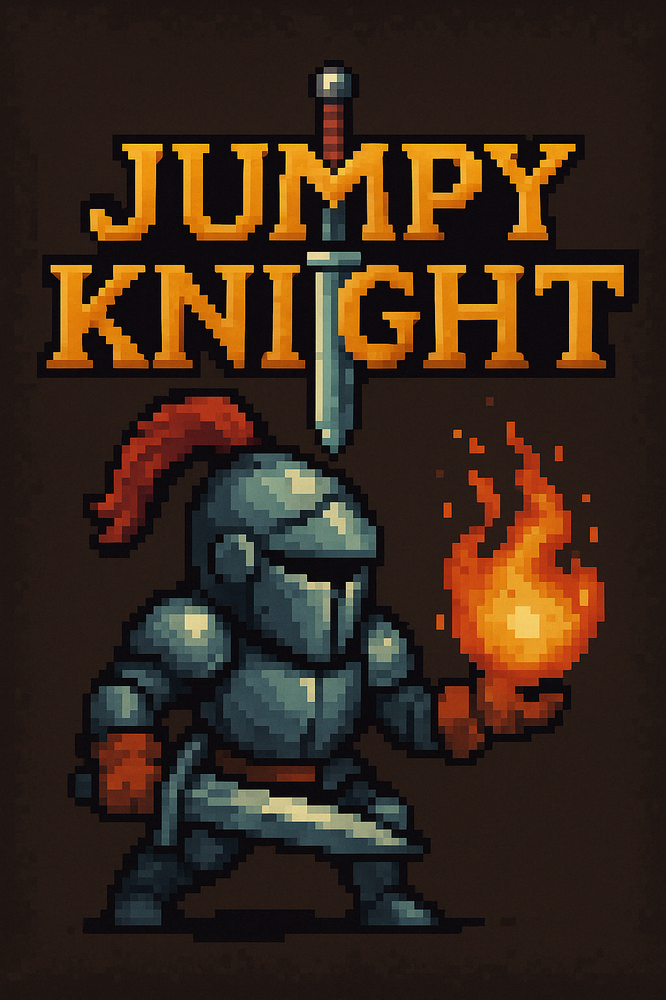

# Jumpy Knight 🏰⚔️



A 2D platformer game where you play as a knight jumping over enemies and using powers to slay monsters. Built with Kaboom.js!

## Gameplay Preview
 *(Replace with actual gameplay screenshot/GIF)*

## Features ✨
- 🎮 Simple controls: Jump, attack, and shoot fireballs
- ⚔️ Multiple abilities: Sword attacks and fireball magic
- 🏆 Score system with high score tracking
- 🎵 Custom sound effects and background music
- ⚙️ Settings menu with volume controls
- 📜 Detailed instructions screen
- 🕹️ Pause functionality

## How to Play 🎯
### Controls:
- **Space/Mouse Click/Tap**: Jump (Double jump available)
- **A Key**: Sword attack
- **F Key**: Shoot fireball (has cooldown)
- **P Key**: Pause game

### Objectives:
- Jump over or attack enemies to avoid losing health
- Earn points by defeating enemies
- Collect powerups to gain triple jump ability
- Survive as long as possible!

## Installation 💻
1. Clone the repository:
   ```bash
   git clone https://github.com/your-username/jumpy-knight.git
